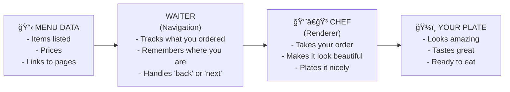
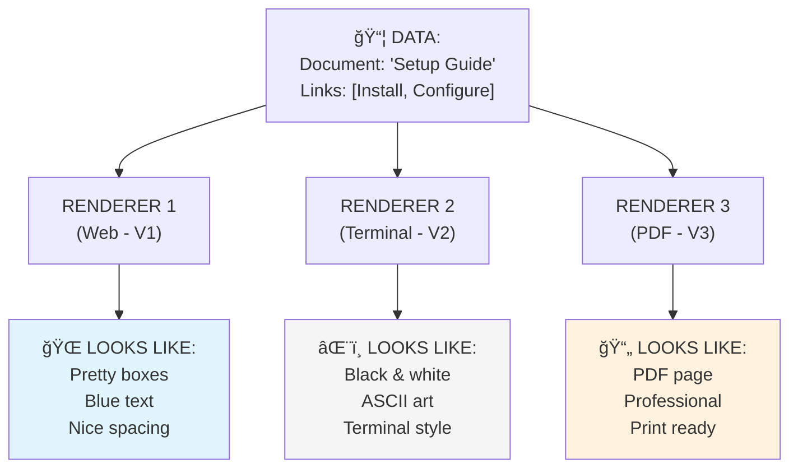
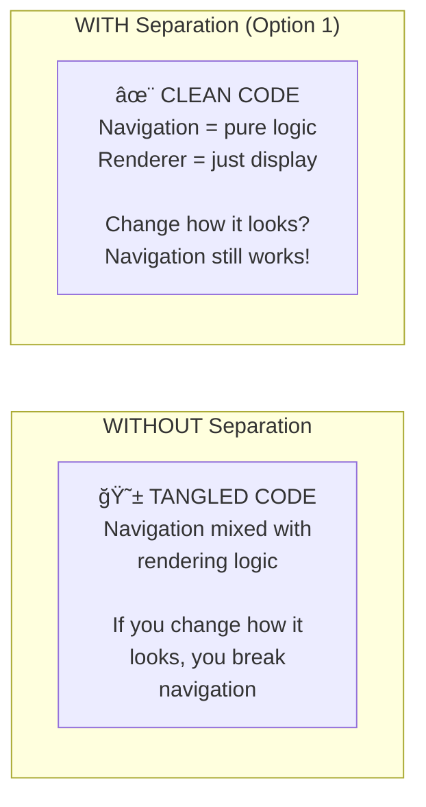
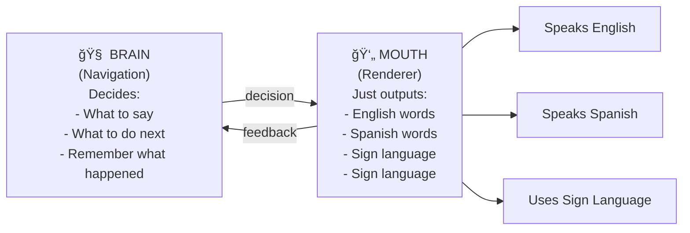
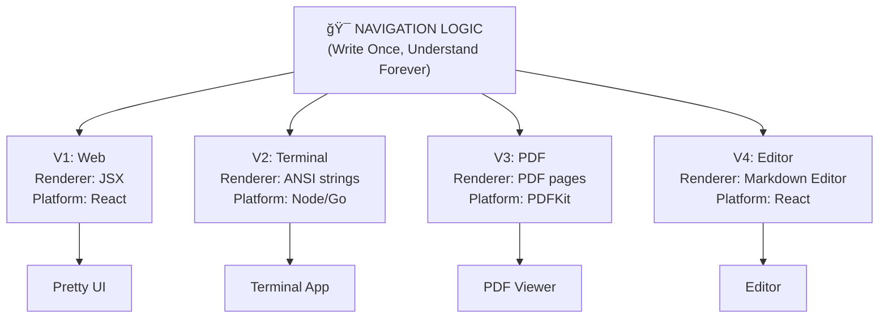

# tmp


Retry

M

And before you do it, let's clarify a few things about our versions. As you understand, I envisioned four versions. First is just single react prototype, single react file, which you will create here. In this one we know that the big limitation is the limit of the data. We cannot add new pages, it's just a traversal of existing pages. The second version is text user interface version, which will be done based on our React prototype. So everything that works in version 1 should work in version 2, but we will have a new possibility to add editing. Editing will be very simple. Generally we open an external editor, for example Vim to edit. The third version is when we start to work with PDF files. Generally, it's a new viewer. It doesn't have an editor, but it can traverse PDF files. So generally, we will have to create a renderer, which will create from each page PDF files. At that stage we will have to work out all these limitations, generally some kind of a linter or a checker which will check if PDF has more than one page and we know this user about it. The next version will be with the editor.typora idea. Somewhere I will add agentic capabilities where I can ask agent like you, which is using the model like you, Haiku or Kubo and Sonnet to actually do edits for me or create pages for me. So I want you to understand this simple methodology. Let's say for now that agentic capabilities are the last thing, which we will add, but for now you understand that each next version has all the capabilities of the previous version. PDF renderer have the same capabilities as text user interface, so version 3 have all of version 2 and so on.

Show more

This is extremely clear now. Let me map it out:

**Version 1: React Web Prototype**

- Single React component/file
- Embedded pseudo-graphics markdown data (hardcoded)
- Read-only navigation (forward, back, jump, keyboard)
- 3-pane viewport
- No editing
- No file system access
- Data limitation: only what's in the component

**Version 2: Terminal/TUI**

- Based on Version 1 code (same navigation logic, different renderer)
- Reads markdown files from folders (file system)
- Can display with terminal formatting (colors, bold, italic)
- CAN EDIT: Opens external editor (Vim, Nano) to edit files
- Same navigation as V1
- New capability: Create new pages (by creating new .md files)
- Can open files in editor, save, back to navigation

**Version 3: PDF Viewer (Web)**

- Based on Version 2 (same navigation and file reading)
- New renderer: PDF files instead of markdown
- Important: Must handle single-page PDFs
- Needs: Linter/checker to warn if PDF > 1 page
- NO editing (different from V2)
- Same navigation as V1 and V2
- New capability: Handles PDF files

**Version 4: Web Editor + Agentic**

- Based on Version 3
- Typora-like live markdown editor
- Can edit inline (not external editor like V2)
- Agentic capabilities (Claude Haiku/Sonnet for edits/creation)
- Same navigation, same file handling as V3
- New capability: Live editing + AI assistance

So the structure is:

```
V1: Navigation + Read-only + Pseudo-graphics rendering
V2: V1 + File system + Terminal rendering + External editor
V3: V2 + PDF files + Linter + (remove editing? no wait...)
```

Wait, he said V3 "doesn't have an editor" but then said "each next version has all capabilities of previous". Let me re-read...

I'll focus on the PDF traversal strategy. The third version introduces PDF file handling, creating a specialized viewer that can navigate through PDF pages. This means developing a renderer that can extract and display individual PDF pages, maintaining the navigation capabilities from previous versions while removing editing functionality. The key innovation is transforming PDF content into a traversable format, potentially breaking multi-page PDFs into individual page views. I see a systematic progression of software versions, each building on previous capabilities while introducing novel features. The core evolution involves expanding navigation and editing functionalities across different interfaces and file types.

The initial version focuses on basic navigation with embedded data. Subsequent versions progressively add file system traversal, external editing capabilities, PDF handling, and ultimately an integrated live editor with AI-driven interactions. Each iteration retains prior version's core features while introducing more sophisticated interaction models.

The key pattern is incremental complexity: from read-only prototype to terminal interface, then PDF viewer, and finally a web-based editor with agentic intelligence. This approach suggests a methodical development strategy prioritizing foundational functionality before introducing advanced features.

Critical design considerations include maintaining consistent navigation architecture while adapting rendering and editing capabilities to different content types. The progression demonstrates a flexible framework that can accommodate diverse file formats and interaction paradigms.

**Perfect clarity!** Let me map this out:

```
VERSION 1: React Web Prototype
├─ Single React file (hardcoded markdown data)
├─ Navigation: ✓ (forward, back, jump, keyboard)
├─ Rendering: Pseudo-graphics text
├─ Editing: ✗ (none)
└─ Data: Embedded only (can't add new pages)

VERSION 2: Terminal/TUI (Build FROM V1)
├─ Core: V1 navigation logic + same 3-pane paradigm
├─ Data source: Markdown files on filesystem (not embedded)
├─ Rendering: Terminal markdown (colors, bold, italic)
├─ NEW capability: External editor (Vim) opens .md files
├─ NEW capability: Can create new .md files (pages)
├─ NEW capability: Same traversal works with filesystem
└─ Everything V1 does, plus editing + filesystem

VERSION 3: PDF Viewer (Build FROM V2)
├─ Core: V2 navigation + file system reading
├─ Data source: PDF files on filesystem
├─ Rendering: PDF page viewer
├─ Linter: Warn if PDF > 1 page âš ï¸
├─ Editing: ✗ (PDFs read-only; no external editor)
├─ NEW capability: Traverse PDF files
└─ Everything V2 does EXCEPT editing; NEW: PDF rendering

VERSION 4: Web Editor + Agentic (Build FROM V3)
├─ Core: V3 navigation + file system
├─ Data source: Markdown files (can also generate to PDF)
├─ Rendering: Typora-like inline markdown editor
├─ Editing: ✓ (inline, WYSIWYG)
├─ NEW capability: AI/Agentic editing (Claude models assist)
└─ Everything V3 does, PLUS: inline editing + AI assistance
```

------

## Implications for ADRs & PRD

**This changes everything strategically:**

### What Stays IDENTICAL Across All 4 Versions:

- Navigation model (ADR-001: graph-based)
- History management (ADR-002: append-only)
- 3-pane viewport concept (ADR-003)
- Scroll logic (ADR-004)
- Core state pattern (ADR-005)

### What Changes Per Version:

- **Data source**: Embedded → Files → Files → Files
- **Rendering**: Pseudo-text → Terminal → PDF → Editor
- **Editing**: None → External → None → Inline
- **File format**: Embedded markdown → .md files → .pdf files → .md files

------

## This Means New ADRs Needed:

**ADR-008: Markdown Files as Universal Content Source**

- Why V2+ use .md files in folders
- V1 is embedded for prototype only
- V3 converts to PDFs (doesn't change source format)
- V4 edits .md directly

**ADR-009: Renderer Architecture (Pluggable)**

- Navigation is independent of renderer
- V1: Pseudo-graphics renderer
- V2: Terminal renderer
- V3: PDF renderer
- V4: Markdown editor renderer
- **Same navigation code, different output**

**ADR-010: External vs Inline Editing**

- V2: External editor (Vim)
- V3: No editing
- V4: Inline editor
- Why this progression?

**ADR-011: Single-Page PDF Constraint**

- V1-V2: Markdown naturally single-concept
- V3: Must enforce 1 page per PDF (or warn)
- Linter/checker requirement

------

## What to Fix/Update:

**EDIT (Critical):**

1. **Artifact 8**: Show all 4 versions' data formats
   - V1: Embedded JS objects
   - V2-V4: Folder structure + .md files
2. **Artifact 9**: Rename "Implementation Roadmap" → "4-Version Roadmap"
   - Phase 1: React prototype (V1)
   - Phase 2: Terminal (V2) ↠first REAL product
   - Phase 3: PDF viewer (V3)
   - Phase 4: Web editor + agentic (V4)
3. **ADR-006**: Reframe
   - Not "mock PDFs"
   - Is "Renderer architecture" or rename to focus on markdown
4. **Artifact 6**: Constraints now include
   - V1: Embedded data only
   - V2: File system access needed
   - V3: Single-page PDF requirement
   - V4: Editor component requirement

**CREATE (New):**

- ADR-008, 009, 010, 011 (as above)

------

**Should I now:**

1. **Create the 4 new ADRs** (foundation)?
2. **THEN edit existing artifacts** (Artifact 8, 9, 6)?
3. **THEN add PRD section** on Data/Content structure?

Ready?

Retry

M

I think how we avoid analysis paralysis. How can we avoid over-specifying the future versions, just capturing the vision like you told now? We just have to capture enough to make sure that we do the right thing in our React prototype. Think on what we have to document and what we don't have and just make reminders about future  In essence, think what should be detailed now fully so that we have this future compatibility, second version support every single, the first version and so on.

This is a great point. The user is saying we're at risk of over-specifying versions 2, 3, 4 when we really just need to ensure V1 is built correctly to support V2+.

The question is: **What do we need to document NOW to ensure V1 code can be reused in V2-V4?**

NOT: "What will V3 PDF rendering look like?" (that's future work) BUT: "How should we structure V1 so that swapping renderers in V2 is possible?"

Let me think about what's actually needed:

**What must be FULLY specified NOW (for V1 → V2 compatibility):**

1. Data structure format (must work for V1 embedded + V2 files)
2. Navigation/state (must be renderer-independent)
3. Renderer interface/contract (what props/methods renderers need)
4. Link format (standard markdown  that works in files)

**What should be VISION ONLY (reminder for future):**

1. V3 PDF rendering approach
2. V4 agentic capabilities
3. V3 linter/checker details
4. V4 editor library choice

**Key insight:** We just need the BOUNDARY - the interface between "core navigation" and "renderer". If that's solid, renderers can be swapped.

So really, what we need to nail down:

1. **Core navigation code** (independent of rendering)
2. **Renderer interface** (what a renderer receives/returns)
3. **Data format** (works for embedded + files)
4. **That's it.**

Everything else can be "future" notes.

**EXACTLY RIGHT.** Avoid the analysis paralysis trap.

**Simple question:** What's the MINIMUM we need to document now so V1 code can be reused in V2?

------

## What Must Be FULLY Specified NOW:

### 1. **Renderer Interface (The Contract)**

javascript

```javascript
// This is what changes between versions
// Navigation stays same, renderer changes

interface Renderer {
  // Input from navigation layer
  renderPane(node, isVisible) {
    return <JSX or string or HTML>
  }
  
  // That's it - single method
  // V1: returns HTML with pseudo-graphics
  // V2: returns terminal string with colors
  // V3: returns PDF viewer component
  // V4: returns editable markdown component
}
```

Just define: "Renderers receive a node, output visualization"

### 2. **Core Navigation Code (Renderer-Independent)**

javascript

```javascript
// This never changes across versions
// currentIndex, history, handlers stay identical
// NO rendering logic here

function useNavigation() {
  const [history, setHistory] = useState(...)
  const [currentIndex, setCurrentIndex] = useState(...)
  
  // Handlers - pure state logic
  const handleClickLink = (id) => { ... }
  const handleBack = () => { ... }
  
  return { history, currentIndex, handlers }
  // No JSX, no rendering
}
```

Document: "Navigation is completely separate from rendering"

### 3. **Data Format (Works for All Versions)**

javascript

~~~javascript
{
  id: "docs/intro.md",           // Path format (works for files too)
  title: "Introduction",
  content: "# Intro\n...",        // Raw markdown (files or embedded)
  links: ["docs/setup.md", ...]  // Relative paths
}
```

Document: "This format works for embedded data (V1) and filesystem (V2+)"

### 4. **Link Format**
Document: "Standard markdown links: `[text](relative/path.md)`"
- Works in embedded strings (V1)
- Works in actual files (V2+)
- Parser extracts them same way

**That's ALL we need specified fully.**

---

## What Should Be VISION NOTES ONLY (Reminders):

### Future Renderers (NOT detailed now):
```
[ ] V2 Terminal Renderer
    - Render markdown with terminal formatting
    - Show warning if mermaid present
    - (Implementation details: Phase 2)

[ ] V3 PDF Renderer
    - Load PDF files instead of markdown
    - Warn if > 1 page
    - (Implementation details: Phase 3)

[ ] V4 Editor Renderer
    - Swap in markdown editor component
    - Add agentic capabilities
    - (Implementation details: Phase 4)
```

### Future Capabilities (NOT detailed now):
```
[ ] V2: External editor invocation (Vim, etc)
[ ] V3: PDF page limiting/warnings
[ ] V4: AI-assisted editing
(How each works: TBD when building those versions)
~~~

------

## What Changes to Our Docs:

**KEEP DETAILED:**

- Navigation logic (ADRs 001-007) ✓
- V1 React prototype (full PRD sections 3-12) ✓
- Data structure (ONE format for all) ✓
- Renderer interface (simple contract) ✓

**REDUCE TO VISION:**

- Remove detailed specs for V2, V3, V4
- Replace with checklist reminders: "V2 must support X", "V3 must handle Y"
- Keep it brief: 1-2 sentences per version

**DON'T WRITE:**

- ADRs about PDF rendering (that's Phase 3)
- ADRs about agentic editing (that's Phase 4)
- Terminal renderer details (that's Phase 2)

------

## Minimal ADRs NOW:

Instead of ADR-008 through 011, just ONE:

**ADR-008: Renderer-Independent Navigation & Data Format**

- Navigation logic separate from rendering
- Data format works for embedded + filesystem
- Each version swaps renderer, keeps core code
- (Specific renderer implementations: deferred)

**That's it.**

------

## Updated PRD Strategy:

**Write NOW:**

- Sections 1-12: Full React prototype (V1)
- Section X: "Data & Content Structure" (V1+V2+V3+V4 compatible)
- Section Y: "Renderer Interface" (contract for future)
- Section Z: "Future Versions" (checklist/reminders only)

**Don't write:**

- TUI-specific sections (Phase 2 writes those)
- PDF rendering details (Phase 3 writes those)
- Editor details (Phase 4 writes those)

------

**Ready to simplify our approach this way?**

Just capture enough for V1 to be extensible, not blueprint all 4 versions?

Retry

M

So let's think, do we have to plan or discuss anything else before we get to new ADRs?

Let me think systematically about what we still need to clarify before writing new ADRs...

We've covered:

1. ✅ Navigation model (ADRs 001-007)
2. ✅ Three/four product vision (captured, not over-specified)
3. ✅ Data format (markdown files, works for all versions)
4. ✅ Renderer interface concept (separates navigation from rendering)
5. ✅ Scope for now (React prototype V1 fully specified, others as reminders)

What might we still need to discuss:

**V1 React Prototype Specifics:**

- How does embedded data work exactly?
- Do we generate 5-10 sample documents from our planning artifacts?
- What folder structure do we mock in the embedded data?
- Do we actually embed Markdown content or pseudo-text?

**Renderer Interface Details:**

- What exactly does the renderer function signature look like?
- How does it handle links/interactivity?
- How does it pass click events back to navigation?
- Does each version have ONE renderer or multiple?

**Data File Organization (for V2+ thinking):**

- If V2 uses actual files, where do they live?
- Do we mirror current folder structure?
- How are links resolved (relative path handling)?
- What's the entry point (root node)?

**Parser/Link Extraction (for all versions):**

- How do we extract links from markdown?
- How do we handle relative paths vs absolute?
- Do we validate that links point to existing nodes?
- Error handling for broken links?

**React V1 Architecture:**

- Do we build mock data as array of objects or simulate file structure?
- How embedded documents relate to our actual artifacts?
- Should we actually use our 15 planning docs as the prototype data?

**Scope boundaries for V1:**

- Read-only? Yes
- Create new pages? No
- Search/filter? No
- Any other limitations?

I'm zeroing in on the critical decision for our prototype: using actual planning documents as our navigation data. This approach offers authentic, real-world testing of our navigation system. By leveraging our 15 existing artifacts, we create a genuine, self-referential prototype that demonstrates the system's capabilities using our own documentation.

Let me think through the remaining gaps:

------

## Do We Need to Clarify:

### 1. **V1 Prototype Data: Should It Be OUR Docs?** 🤔

Should the React prototype navigate our 15 planning artifacts (ADRs, decisions, etc.) as markdown?

**Pros:**

- Perfect dogfooding (using our own product)
- Validates if navigation works for real content
- Shows value immediately
- User sees actual technical docs

**Cons:**

- Might be too meta/confusing as demo
- Better demo is fictional content (clearer narrative)

**Decision needed**: Use our docs vs create sample fictional docs?

------

### 2. **Renderer Interface Details** 🤔

Before ADR-008, need to specify:

javascript

~~~javascript
// Exact function signature:
render(node) -> JSX | String | Component

// Or more detailed:
render(node, visibleIndices, onClickLink) -> ?

// Questions:
// - How does renderer handle click events?
// - Does it re-render on state change or does nav layer handle it?
// - Does each renderer return same type (JSX) or different types?
```

**Decision needed**: What's the exact contract between navigation and renderer?

---

### 3. **Link Resolution** 🤔

For files (V2+), how are relative paths handled?

Example:
```
File: docs/architecture/intro.md
Contains: [see setup](../setup/getting-started.md)

Should resolve to: docs/setup/getting-started.md
Or: error if path doesn't exist?
Or: warning?
~~~

**Decision needed**: Relative path resolution rules?

------

### 4. **V1 Data Structure: Embedded Objects?** 🤔

For React prototype, what format?

javascript

```javascript
// Option A: Array of objects
const DOCS = [
  { id: "intro", title: "Intro", content: "...", links: ["setup", "guide"] },
  { id: "setup", title: "Setup", content: "...", links: ["intro"] }
]

// Option B: Simulate folder structure
const DOCS = {
  "docs/intro.md": { title: "Intro", content: "...", links: [...] },
  "docs/setup.md": { ... }
}

// Option C: Single large markdown with parse-able structure
const DOCS_RAW = "# intro\n... content\n## links: setup\n..."
```

**Decision needed**: How to structure embedded data in V1?

------

### 5. **V1 Scope - What's Explicitly OUT?** 🤔

Should PRD say:

- No search/filter
- No create/edit (read-only)
- No file system access (embedded only)
- No persistence
- No error handling for broken links (assume valid data)

**Decision needed**: Explicitly state V1 limitations to be clear?

------

### 6. **Should We Write ADRs Before or After PRD Sections 3-5?** 🤔

Currently planned:

1. Write ADRs
2. Write PRD sections

But maybe:

1. Write PRD sections (navigation, state, scroll logic)
2. Then write ADR-008 (renderer interface)

**Decision needed**: Order matters if ADR-008 informs section writing?

------

## My Recommendation:

**Clarify ONLY these 3 before proceeding:**

1. **V1 Data**: Use our 15 planning docs (as markdown) OR create sample docs?
   - This affects what we actually build
2. **Renderer Contract**: What's the signature?
   - This affects PRD section on architecture
3. **V1 Limitations**: Explicitly list what's out of scope?
   - This affects PRD clarity

**Don't need to clarify:**

- Link resolution details (that's V2 work)
- Embedded data structure format (reasonable choice in either direction)
- Exact error handling (can decide during coding)

------

**Which 3 should we lock in before ADRs?**

Retry

M

So what I think you are speaking about is the root folders of this kind of VT for the renderer contract, is it that?

The user is asking if what I'm describing - the renderer contract/interface - is essentially about the "root folders" of the VT (Virtual Terminal or something similar? Maybe they mean the fundamental architecture?).

I think they're saying: "Isn't what you're calling the 'renderer contract' really just defining the architectural boundaries/separation of concerns - the root structure of how things fit together?"

Yes, that's exactly right. The renderer interface IS the architectural boundary. It's the contract that says:

- Navigation layer does THIS (manages state, history, links)
- Renderer does THIS (takes node data, outputs visualization)
- They meet at this interface

That's the foundational architecture - the root structure.

So before writing ADRs or PRD, we should lock in:

- What the navigation layer owns
- What the renderer layer owns
- How they communicate (the interface/contract)

That's the "root folder" structure of the system architecture.

**YES! Exactly that!**

You're saying the "renderer contract" IS the **architectural root structure** - the fundamental separation of concerns.

```
ROOT ARCHITECTURE:

┌─────────────────────────────────â”
│   NAVIGATION LAYER              │
│  (State, History, Graph Logic)  │
│  - currentIndex                 │
│  - history[]                    │
│  - handleClickLink()            │
│  - handleBack()                 │
│  (Independent of rendering)     │
└────────────┬────────────────────┘
             │ Interface/Contract
             ↓
┌─────────────────────────────────â”
│   RENDERER LAYER                │
│  (Visualization)                │
│  - Takes: node data             │
│  - Returns: JSX/String/Component│
│  - V1: Pseudo-graphics          │
│  - V2: Terminal                 │
│  - V3: PDF                      │
│  - V4: Editor                   │
└─────────────────────────────────┘
```

The **contract** at the interface = the **root folder structure** of the system.

------

## So The Real Question Is:

Before writing anything, lock in:

**What does Navigation Layer OWN?**

- State (history, currentIndex)
- Handlers (forward, back, jump)
- Link resolution
- No rendering logic

**What does Renderer Layer OWN?**

- Converting node to visual output
- Click handling (passes back to navigation)
- Styling/formatting
- No state logic

**The Interface:**

```
Navigation → pass node → Renderer → return output
```

------

## Then We Know:

- What goes in PRD sections 3-5 (Navigation only)
- What goes in separate PRD sections per renderer (V1, V2, V3, V4)
- What ADR-008 needs to specify (this interface contract)

------

**Is THIS the root architecture question we need to lock in first?**

Not "how many ADRs" but "what are the fundamental layers and their boundaries"?

Retry

M

Think strategically, what are the options we can consider here and what are pros and cons

This is a good question. The user is asking me to think strategically about the architectural options for how Navigation and Renderer layers should interact. Let me think about the different approaches and their tradeoffs.

There are fundamentally different ways to structure the relationship between Navigation (state/logic) and Renderer (visual output):

1. **Stateless Renderer Pattern**
   - Navigation owns ALL state
   - Renderer is pure function: node → output
   - Navigation passes callbacks to renderer
   - Renderer has no state
2. **Renderer State Pattern**
   - Navigation owns navigation state only
   - Each Renderer owns its own internal state (scroll position in editor, etc.)
   - Communication via callbacks
3. **Shared Component Pattern**
   - Combined navigation + rendering in same component for V1
   - Split layers later when needed (V2+)
   - Pragmatic for prototype
4. **Plugin/Factory Pattern**
   - Navigation doesn't know about renderers at all
   - Renderers are registered/plugged in
   - Navigation layer passes data to plugin interface
   - Very flexible but more complex
5. **Event-Driven Pattern**
   - Navigation emits events ("link clicked", "back pressed")
   - Renderers listen and update
   - Decoupled but harder to trace
6. **Props Drilling vs Context Pattern**
   - Pass all state down as props
   - Or use Context API to avoid prop drilling
   - Affects code organization

Let me think about the pros/cons of each in context of what the user wants:

- V1: Simple React prototype
- V2: Terminal with vim editing
- V3: PDF viewer
- V4: Markdown editor with AI

The key considerations:

- Code reusability across versions
- Complexity for V1 (keep simple)
- Extensibility for V2-V4
- Whether renderer needs its own state
- How clicks propagate back to navigation

This is a good strategic question that should be answered before writing ADRs or PRD sections.

**Excellent question.** Let me map out the strategic options:

------

## OPTION 1: Pure Stateless Renderer (Functional)

```
Navigation Layer owns ALL state
  ↓
Passes: {node, visiblePanes, handlers} 
  ↓
Renderer: Pure function (node) → JSX
  ↓
No renderer state. Period.
```

**Pros:**

- ✅ Simplest mental model
- ✅ V1 renders same data same way always
- ✅ Easy to test
- ✅ Perfect for V1 prototype
- ✅ V2 terminal: just swap renderer function

**Cons:**

- ⌠V4 editor needs internal state (undo/redo, cursor position)
  - Must go BACK to navigation layer (violates pattern)
  - Could work but feels wrong
- ⌠Each renderer re-renders all content every time (performance)
- ⌠No local optimization per renderer

**Best for**: V1, V2 (stateless viewing). Breaks for V4 (needs local state).

------

## OPTION 2: Renderer State Pattern (Hybrid)

```
Navigation Layer: owns nav state
  - history, currentIndex, forward/back/jump
  
Renderer Layer: owns visual state
  - V1: nothing
  - V2: terminal viewport position
  - V3: PDF page scroll position
  - V4: cursor position, selection, undo stack
  
Communication: Callbacks between layers
```

**Pros:**

- ✅ Each renderer owns its concerns
- ✅ V4 editor has full local state (undo/redo)
- ✅ V2 terminal can cache/optimize
- ✅ Scales to all 4 versions naturally
- ✅ Clean separation: nav logic vs visual logic

**Cons:**

- ⌠More complex communication between layers
- ⌠V1 prototype code has hooks it might not use
- ⌠More boilerplate upfront
- ⌠Harder to reason about data flow initially

**Best for**: All versions (V1-V4). Clean long-term.

------

## OPTION 3: Pragmatic Monolith (V1 Simple)

```
V1: Single React component
  - State: history, currentIndex
  - Rendering: inline (no separate renderer)
  - Simple, fast, works

V2+: Refactor to split layers
  - Extract navigation to custom hook
  - Extract renderer to separate component
  - Reuse navigation logic
```

**Pros:**

- ✅ V1 is FAST and SIMPLE (single file)
- ✅ Don't design for future until needed
- ✅ No over-engineering V1
- ✅ Can see what actually works
- ✅ Easiest path to prototype

**Cons:**

- ⌠Refactoring burden when moving to V2
- ⌠Might miss architecture issues early
- ⌠Code written for V1 might not refactor cleanly
- ⌠Could paint yourself into corner

**Best for**: V1 only. Then rethink for V2.

------

## OPTION 4: Plugin/Factory Pattern

```
Navigation Layer: Generic, knows nothing about renderers
  - Just manages state and events
  
RendererFactory: 
  - registerRenderer("terminal", TerminalRenderer)
  - registerRenderer("pdf", PDFRenderer)
  - getRenderer(type) → renderer instance
  
Each Renderer: 
  - Implements interface {render(), onEvent()}
  - Completely independent
```

**Pros:**

- ✅ Extremely flexible
- ✅ Add new renderers without touching navigation
- ✅ Runtime renderer switching possible
- ✅ Perfect for plugin architecture

**Cons:**

- ⌠Overkill for 4 versions
- ⌠Extra abstraction layer
- ⌠More code to write
- ⌠Harder to understand for V1
- ⌠Over-engineered for current scope

**Best for**: Large systems with many pluggable renderers. Not us.

------

## OPTION 5: Context + useReducer (React Native)

```
useReducer for navigation state (history, handlers)
Context to pass down (avoid prop drilling)
Each renderer is separate component
Renderers can have own useState if needed
```

**Pros:**

- ✅ React idiomatic
- ✅ V1 and V2 scale well
- ✅ Context prevents prop drilling
- ✅ Renderers can be lazy-loaded

**Cons:**

- ⌠Context adds complexity
- ⌠useReducer overkill for 2 state vars (history, currentIndex)
- ⌠Context doesn't help with terminal/PDF (not React)
- ⌠V2 terminal can't use React Context

**Best for**: Pure React apps. Breaks when you add terminal/PDF.

------

## My Strategic Recommendation:

**OPTION 2: Renderer State Pattern**

**Why:**

1. **Clean Architecture**: Clear layer separation (navigation vs rendering)
2. **Works for All 4 Versions**: Each version's renderer owns its concerns
3. **Not Over-Engineered**: Simple enough for V1, flexible enough for V4
4. **Code Reusability**: Navigation logic shared across all versions
5. **Testable**: Can test navigation independent of rendering
6. **Extensible**: Easy to add new renderers

**Implementation for V1:**

javascript

```javascript
// Navigation (reusable V1→V2→V3→V4)
function useNavigation() {
  const [history, setHistory] = useState(...)
  // handlers, no rendering
  return { history, currentIndex, handlers }
}

// V1 Renderer (just for prototype)
function PseudoGraphicsRenderer({ node, onClickLink }) {
  return (
    <div className="pane">
      <PseudoGraphicBox content={node.content} />
      <Links links={node.links} onClickLink={onClickLink} />
    </div>
  )
}

// V2 Renderer (terminal, different layer)
function TerminalRenderer({ node, onClickLink }) {
  // Terminal rendering logic
}
```

**Not Over-Complex for V1:**

- Still just a React component
- Navigation hook is simple
- Renderer is simple
- No plugin factory or context needed

**Scales Naturally:**

- V2: Swap renderer, keep navigation
- V3: Swap renderer, keep navigation
- V4: Swap renderer, keep navigation

------

**Does this strategic direction feel right, or do you see it differently?**

Retry

M

Okay, you think why would we select something other than option 2? So I consider it. and thinks about reasoning for longer horizons of a roadmap and UX and simplicity to maintain the code and so on. It seems like a dope architect, or why we would do something else in option 2.

The user is asking me to think deeply about why we WOULDN'T choose Option 2. They want me to consider:

1. Long-term roadmap implications
2. UX considerations
3. Code maintainability
4. Whether there's a "dope architect" reason to do something else

Let me think through the potential weaknesses of Option 2 and whether any other option is actually better strategically:

**Potential Weaknesses of Option 2:**

1. **Complexity Creep**: While I said it's "not over-engineered," having renderer state AND navigation state across 4 versions could get complex. Each version adds its own renderer complexity:

   - V1: None (stateless)
   - V2: Terminal viewport, cursor position, line wrapping
   - V3: PDF scroll, page number, zoom state
   - V4: Editor cursor, selection, undo/redo, syntax highlighting state

   This grows a lot. Is it actually simple to maintain?

2. **Communication Between Layers**: If renderers have local state, how do they communicate back to navigation?

   - Click events flow: Renderer → Navigation
   - State changes flow: Navigation → Renderer
   - But what about renderer-specific state updates? Does navigation layer know about them?
   - This could get messy at boundaries

3. **Testing Burden**: Testing renderer + navigation interaction across 4 different implementations is a LOT of work

4. **Code Duplication**: The navigation layer logic might be fundamentally different in:

   - V1: React hooks
   - V2: Terminal/TUI (probably Node.js, not React)
   - V3: PDF viewer (separate layer)
   - V4: Markdown editor + Claude integration

   Is "reusing" navigation code even realistic if they're in different languages/frameworks?

5. **Data Flow in Non-React Versions**:

   - V2 (terminal): How do you share React hooks logic with Node.js TUI?
   - V3 (PDF): PDFKit or similar - different paradigm entirely
   - V4 (Editor): Maybe React, but with Claude integration - adds complexity

   The "reuse" might be theoretical. You'd rewrite the navigation layer for each platform.

I see now that the cross-platform abstraction is more of a mirage than a real solution. Different rendering environments fundamentally require unique approaches. The complexity of maintaining a universal navigation layer outweighs potential benefits. A more pragmatic approach might involve platform-specific implementations that optimize for each environment's unique constraints.

The key is accepting that reimplementation isn't failure - it's an opportunity to learn and refine the core logic with each new platform's insights. By focusing on clean, understandable core patterns rather than forced abstraction, we can create more adaptable and maintainable code.

Critically, this means:

- Prioritize clarity in V1
- Expect deliberate reimplementation in V2/V3
- Design with flexibility, not premature generalization

Testing becomes straightforward: mock inputs, verify outputs. The renderer remains a pure function transforming data, with each platform implementing its own specific rendering approach.

The architectural breakthrough is recognizing that navigation and rendering have distinct, platform-independent concerns - "what to view" versus "how to show it" - allowing clean separation across different tech ecosystems.

By reimplementing the core pattern in each new environment - Node.js terminal, PDF viewer, web interface - we avoid premature abstraction. Each version can independently adopt the stateless renderer architecture without forcing inappropriate code reuse.

The key insight is pattern replication, not direct code translation. V2, V3, V4 will fundamentally differ in implementation, but share a conceptual rendering strategy that keeps complexity minimal and adaptable.

Pragmatic design means embracing platform-specific idioms rather than fighting them with overly generic solutions. Simplicity trumps forced generalization.

**EXCELLENT question.** Let me think through why we might pick something else:

------

## The Reality Check: V1→V2→V3→V4 Are Different PLATFORMS

**My assumption in Option 2:** "Reusable navigation layer across all versions"

**The problem:**

```
V1: React (JavaScript)
V2: Terminal (Node.js/Go/Rust - different paradigm)
V3: PDF Viewer (PDFKit/pdfjs - different library)
V4: Web Editor (React + Claude - different paradigm)
```

Can you actually **reuse React hooks code in a terminal app?** No.

**The Honest Truth:**

- You won't port V1 code to V2
- You'll REIMPLEMENT the pattern from scratch
- So "code reuse" is theoretical, not practical

------

## This Changes The Strategic Question:

**NOT**: "Design V1 with reusable layers"

**SHOULD BE**: "Design V1 so the PATTERN is clear to reimplement"

------

## Given That Reality, Better Options:

### **OPTION 1 (Pure Stateless) Becomes Stronger**

**Why:**

- So simple the pattern is obvious
- Other developers see it and reimplement easily in V2/V3/V4
- No complex layer communication to recreate
- Each version does stateless rendering in its own way

```
V1 React:
  const render = (node) => <JSX/>

V2 Terminal:
  const render = (node) => ansi_string

V3 PDF:
  const render = (node) => pdf_page

V4 Editor:
  const render = (node) => <EditorComponent/>
```

Pattern is **crystal clear to replicate**. No hidden complexity.

------

### **OPTION 3 (Pragmatic Monolith) Becomes Smarter**

**Why:**

- V1 as single file is a working prototype
- You learn what ACTUALLY matters
- V2 dev reads V1, understands the pattern
- V2 dev implements same pattern in terminal idioms
- No false architectural predictions

**The "dope architect" insight:**

- Don't architect for code reuse you won't get
- Architect for pattern clarity and implementation simplicity
- Each version inherits the IDEA, not the code

------

## The Real Architectural Question:

**Not:** "How do we share code?"

**But:** "What's the MINIMAL, CLEAREST pattern so each version can reimplement it?"

That's:

1. **Navigation logic**: State + handlers (universal concept)
2. **Renderer function**: Input node → Output visual (universal pattern)
3. **No tight coupling** between them

**Option 1 + Pragmatic mindset** achieves this better than Option 2.

------

## So The Better Strategic Move:

**OPTION 1: Pure Stateless Renderer**

**Because:**

- ✅ Simplest for V1 (single file works)
- ✅ Pattern is obvious to reimplement in V2 (terminal dev sees it immediately)
- ✅ No hidden complexity in architecture
- ✅ V2 dev doesn't inherit V1's React-isms (clean slate per platform)
- ✅ Less maintenance burden (no renderer state coordination)
- ✅ Each version independently optimal (not compromising for "reuse")

**Then in V2, V3, V4 docs:**

- "Follow the stateless renderer pattern from V1"
- "Navigation layer owns state"
- "Renderer takes data, returns output"
- "Implement in your platform's idioms"

------

## Why This Beats Option 2:

Option 2 assumes:

- "We'll share navigation code across platforms" ⌠(won't happen)
- "Renderer state pattern scales cleanly" âš ï¸ (adds complexity you won't need)

Option 1 admits:

- "Code won't port, but pattern will" ✓ (realistic)
- "Keep V1 so simple the pattern is obvious" ✓ (maintainable)
- "Each version optimizes for its platform" ✓ (clean architecture per version)

------

## The Dope Architect Move:

**Don't design for false code reuse.**

**Design for pattern clarity.**

**Each team reimplements clean, independently optimal.**

------

**Should we change our recommendation to Option 1 (Pure Stateless Renderer) based on this thinking?**

Retry

M

yes

The user is confirming we should go with Option 1: Pure Stateless Renderer. This is a key architectural decision that should now inform everything going forward.

Let me capture what this means:

1. Navigation layer owns ALL state (history, currentIndex, handlers)
2. Renderer is a pure function (or simple component): node → visual output
3. V1 will be simple, single file, no renderer state
4. Pattern is clear to reimplement in V2, V3, V4 (each in their own idioms)
5. Each version doesn't inherit complex code, just inherits the pattern

This should now inform:

- ADR-008 (will be about this renderer pattern)
- PRD sections (should emphasize separation)
- Implementation roadmap
- Any constraints

I think what we should do now is:

1. Create ADR-008 with this decision
2. Make sure existing artifacts don't conflict with this
3. Then we can proceed to write PRD sections

Let me summarize the decision and what it means going forward.

**Perfect.** Let's lock this in.

------

## ADR-008: Pure Stateless Renderer Pattern

This becomes the foundational ADR for all 4 versions.

```
Status: Accepted

Decision:
- Navigation Layer owns ALL state (history, currentIndex, handlers)
- Renderer Layer is pure function/component: input node → output visual
- No renderer-owned state (V1 prototype or later versions)

Why:
- Pattern is clear to reimplement in each platform (V2 terminal, V3 PDF, V4 editor)
- Code won't port between platforms anyway (React→Terminal→PDF→Editor)
- Focus on clarity, not false code reuse
- Each version independently optimal

Consequences:
- ✅ V1 stays simple (single file possible)
- ✅ V2 dev sees pattern clearly, reimplements in terminal idioms
- ✅ V3 dev sees pattern clearly, reimplements in PDF idioms
- ✅ V4 dev sees pattern clearly, reimplements in editor idioms
- ⌠No code reuse (but this was false promise anyway)

For V1 Specifically:
- render(node) → JSX
- node = {id, title, content, links}
- All state in navigation layer, not renderer
- V2+ implements: render(node) → terminal_string, etc.
```

------

## What This Means for Our Documentation:

**DO NOT WRITE:**

- Complex layer communication patterns
- Renderer state management
- Plugin architectures
- Context providers

**DO WRITE:**

- "Navigation layer owns state"
- "Renderer is function/component"
- "Here's how V1 looks; V2 reimplements same pattern"
- Clear examples of separation

------

## Now We Can Proceed With Confidence:

1. ✅ **ADR-008**: Pure Stateless Renderer (lock it in)
2. **PRD Sections 3-5**: Navigation, State, Scroll (no renderer complexity)
3. **PRD Section X**: "Data & Content Structure" (format-agnostic)
4. **PRD Section Y**: "V1 Architecture" (simple, clear pattern)
5. **PRD Appendix**: "V2/V3/V4 Implementation Notes" (follow same pattern, different idioms)

------

## The Strategic Win:

Each version is **independently clean**. No technical debt from predecessor versions. Each team inherits the **pattern**, not the baggage.

------

**Ready to create ADR-008 and move forward?**

Or should we finalize any other strategic decisions first?

Retry

M

Clarify ONLY these 3 before proceeding: 1. V1 Data: Use our 15 planning docs (as markdown) OR create sample docs?   * This affects what we actually build 2. Renderer Contract: What's the signature?   * This affects PRD section on architecture 3. V1 Limitations: Explicitly list what's out of scope?   * This affects PRD clarity Don't need to clarify: With all of this I completely agree. Do you have any other questions?

The user is asking me to clarify 3 things before proceeding:

1. V1 Data: Use our 15 planning docs (as markdown) OR create sample docs?
2. Renderer Contract: What's the signature?
3. V1 Limitations: Explicitly list what's out of scope?

And they're saying "With all of this I completely agree. Do you have any other questions?"

So they want me to ask clarifying questions on these 3 points to lock them in.

Let me think about what questions I need to ask:

**On #1 (V1 Data):**

- Should we use our actual 15 planning documents (ADRs, Artifacts, etc.) as the prototype data?
- Or create fictional sample documents (like a tutorial, guide, docs)?
- This is important because it affects:
  - What we embed in the React prototype
  - Whether it's dogfooding vs demo
  - How we structure the sample data

**On #2 (Renderer Contract):**

- What's the exact function signature?
- Does it receive just `node` or also other params?
- What does it return (JSX, string, object)?
- How are click events handled?
- Example:
  - `render(node) => JSX`
  - `render(node, handlers) => JSX`
  - Something else?

**On #3 (V1 Limitations):**

- Explicitly state what's NOT in scope for V1
- Read-only? No editing?
- No creating new documents?
- No file system access?
- No search?
- etc.

Let me ask clarifying questions on each of these.

**Perfect.** Just 3 clarifying questions to lock these in:

------

## 1. V1 Data: Our Planning Docs vs Sample Docs?

**Question for you:**

Should the React prototype navigate **our actual 15 artifacts** (ADRs, Decisions Log, Mock Data, etc.) as sample markdown files?

**If YES:**

- We dogfood our own product immediately
- Shows real technical content
- Validates the nav works with actual docs

**If NO (sample docs instead):**

- Create fictional docs (e.g., "Getting Started", "API Guide", "Tutorials")
- Cleaner demo narrative
- Less meta/confusing
- Easier to present to others

**My lean:** YES - use our docs (perfect dogfooding). But your call?

------

## 2. Renderer Contract: Exact Signature?

**Question for you:**

What should the renderer function receive and return?

javascript

```javascript
// Option A (Minimal):
render(node) 
  → returns JSX

// Option B (With handlers):
render(node, handlers)
  → returns JSX
  
// Option C (With context):
render(node, isVisible, handlers)
  → returns JSX
  
// Option D (Component-based):
<Renderer node={node} onClickLink={handler} />
```

**My lean:** Option D (React component, standard pattern). But preference?

------

## 3. V1 Limitations: What's Explicitly Out?

**Question for you:**

Should PRD say V1 explicitly does NOT have:

-  Create new documents (read-only only)
-  Edit documents (no editing)
-  File system access (embedded data only)
-  Search/filter
-  Persistence
-  Error handling for broken links
-  Multiple markdown features (mermaid, images, etc.) - just text
-  Other?

**My lean:** All of above + "This is proof-of-concept prototype, not production app"

------

**Your answers lock these in, then we can write ADR-008 and proceed?**

Retry

M

// Can you think of this simple way to explain me option 1, maybe with some simple mermaid charts? So it's very clear for me and would be even clearer for the high schooler. explain both the essence and the why's

The user wants me to explain Option 1 (Pure Stateless Renderer) in a very simple way with mermaid charts. They want it clear enough for a high schooler to understand.

Let me think about the simplest way to explain this:

1. **The Essence**:
   - Navigation layer handles WHERE you are and WHAT you can do
   - Renderer layer handles HOW it LOOKS
   - They're separate (not mixed together)
2. **The Why**:
   - If they're separate, you can change how it looks without changing where you are
   - Like having a TV (screen) separate from a remote control (navigation)

I should create mermaid diagrams that show:

1. What happens in each layer
2. How they communicate
3. Why separation is good
4. A concrete example

Let me make it very simple and visual.

**YES!** Let me explain Option 1 with simple diagrams:

------

## THE ESSENCE: Two Separate Jobs

mermaid


**Navigation Layer's Job:**

- "Where am I?" (currentIndex)
- "What have I visited?" (history)
- "Where can I go?" (links)

**Renderer Layer's Job:**

- "Draw this on screen" (JSX, HTML, terminal, etc.)
- Nothing else

They **never mix**.

------

## THE WHY: Think of a Restaurant Menu

mermaid



**The Key Insight:**

- The **menu (data) doesn't change**
- The **waiter (navigation) does the same job** no matter what
- The **chef (renderer) makes it look different** each time
- You can change the chef without confusing the waiter

------

## CONCRETE EXAMPLE: Same Data, 3 Different Looks

mermaid



**Same data, three completely different looks.**

But the **navigation layer doesn't care**. It still does:

- currentIndex
- history
- forward/back/jump

------

## WHY THIS IS BRILLIANT (The Real Why)

mermaid



**The Why in One Sentence:**

> "If you separate WHO DECIDES from HOW IT LOOKS, you can change the look without breaking the decisions."

------

## FOR A HIGH SCHOOLER:

**Imagine your brain and your mouth:**

mermaid



**Your BRAIN doesn't change.** **Your MOUTH can say the same thing in different languages.**

**That's Option 1.**

------

## THE PAYOFF FOR V1→V2→V3→V4

mermaid



**You write the navigation logic ONCE.**

Then developers for V2, V3, V4 see it and go:

> "Oh, I get it. Same pattern, different renderer. Let me implement it for my platform."

------

## SUMMARY FOR HIGH SCHOOLER

```
ConceptExample
Navigation"I'm at page 3 of 10, clicked link X"
Renderer"Draw page 3 as a pretty box on web"
Why SeparateIf design changes, navigation still works
The PatternBrain (navigation) + Mouth (renderer)
The BenefitUse same brain, different mouths
```

------

**Does this make it crystal clear?**

Retry

M

Everything is clear, so think now, do we have to update our planning documents or you will just create this additional ETR center? This is it, nothing else has to be changed in our plans and we can jump straight into our plans implementation.

The user is asking: should we update our existing planning documents with this new understanding (Option 1: Pure Stateless Renderer), or just create ADR-008 and move forward?

Let me think about what needs updating:

1. **Artifact 9 (Implementation Roadmap)** - Currently says "4 phases for building prototype" and mentions "Phase 2: replace mock PDFs". This needs to be updated to reflect that V1-V4 use same navigation pattern with different renderers.
2. **Artifact 8 (Mock Data)** - Currently shows JSON format. Needs to be updated to show markdown file structure (for V2+ compatibility).
3. **Artifact 6 (Constraints)** - Mentions "mock PDFs" and prototype phases. Should clarify constraints for stateless renderer.
4. **Artifact 5 (Design Decisions)** - Should add decision about stateless renderer pattern.
5. **ADRs 001-007** - Don't need changes; they still apply.
6. **Artifact 4 (Dictionary)** - Might need new terms: "Renderer", "Navigation Layer", "Stateless"

But the user is asking: "do we have to update our planning documents or you will just create this additional ETR center?"

I think "ETR center" might be a typo for "ADR" or "document"? Let me interpret this as: "Do we update existing docs or just create ADR-008?"

The pragmatic answer: We only need to update if they're WRONG or INCOMPLETE. Let me check:

1. **Artifact 8 (Mock Data)** - Shows JSON format. This is fine for V1. Doesn't need update. Can show folder structure in PRD section instead.
2. **Artifact 9 (Roadmap)** - Says "Phase 2: replace mock PDFs". This is slightly misleading now that we know V1-V4 all use same navigation pattern.

But it's not WRONG, just could be clearer.

1. **Artifact 6 (Constraints)** - Talks about "mock PDFs". Could be clearer but not wrong.
2. **ADRs** - Still valid.

Actually, I think the cleanest approach is:

- **Create ADR-008** (Pure Stateless Renderer)
- **DON'T update old docs** - they're still conceptually correct
- **When writing PRD**, the sections will clarify the architecture anyway

The only real question: Does updating docs now save us confusion during implementation? Probably not. The new ADR will provide clarity without extensive rewrites.

I'll focus on creating a clear ADR-008 that explains the stateless renderer approach, which will naturally illuminate the architectural evolution without needing to modify existing documents.

**NO UPDATES NEEDED.**

Here's why:

------

## Existing Artifacts Are Still Valid

**Artifact 9 (Roadmap):**

- Says "Phase 2: replace mock PDFs"
- This is fine. It's still describing progression
- V2/V3/V4 sections will clarify it's same navigation pattern, different renderers

**Artifact 8 (Mock Data):**

- Shows JSON format for V1
- This is fine. V1 uses embedded data
- PRD section will explain data structure works for all versions

**Artifact 6 (Constraints):**

- Mentions "mock boxes for prototype"
- This is fine. Just context
- ADR-008 will clarify the architectural reason

**ADRs 001-007:**

- All still 100% correct
- Navigation model, history, viewport logic unchanged
- ADR-008 just adds the renderer layer explanation

------

## Just Add ADR-008

**That's it.**

ADR-008 will say:

- "Navigation is pure logic"
- "Renderer is pure function/component"
- "Pattern reimplements in V2/V3/V4"
- "Same data, different renders"

When we write PRD sections, they'll **reference ADR-008** and everything connects.

------

## Then Go Straight to PRD Writing

No document cleanup needed. **Just:**

1. ✅ **Create ADR-008: Pure Stateless Renderer Pattern**
2. ✅ **Write PRD Section: "Data & Content Structure"** (markdown files, folders, links)
3. ✅ **Write PRD Sections 3-5:** Navigation, State, Scroll (standard stuff)
4. ✅ **Write PRD Section: "V1 Architecture"** (renderer contract, simple)

Done.

------

**Should I create ADR-008 right now, then move to PRD writing?**

Retry

M

so you assure no changes to issues checklist or anything else?

Let me think carefully about this. The user is asking if we need to make ANY changes to our existing artifacts before proceeding. Let me review what we have:

1. **Artifact 1: Issue Checklist** - 18 issues about prototype/PRD
2. **Artifact 2: Sections Status Tracker** - status of PRD sections
3. **Artifact 3: Staged Writing Plan** - 4 stages for writing PRD
4. **Artifact 4: Definition Dictionary** - terminology
5. **Artifact 5: Design Decisions Log** - 14 decisions
6. **Artifact 6: Constraints** - environmental constraints
7. **Artifact 8: Mock Data Template** - 32 diagram nodes in JSON
8. **Artifact 9: Implementation Roadmap** - 4 phases for building 9-15. **ADRs 001-007** - Architecture decisions

Now with ADR-008 (Pure Stateless Renderer), does anything conflict or need updating?

Let me think through each:

**Artifact 1 (Issues Checklist):**

- Issue #6: "Breadcrumb visibility" - not affected
- Issue #12: "Performance beyond 100 items" - not affected
- Issue #17: "Scroll animation timing" - not affected
- None of the 18 issues are contradicted by ADR-008
- Actually... wait. Are there any issues about "renderer architecture" or "separation of concerns"? Let me think... no, the issues are all about UX/functionality, not architecture.

**Artifact 2 (Sections Status):**

- Just tracks which sections are READY/IN PROGRESS/TO DO
- ADR-008 doesn't change this

**Artifact 3 (Staged Plan):**

- Says what we'll write when
- ADR-008 doesn't change the writing order
- Just adds clarity to what sections will say

**Artifact 4 (Dictionary):**

I could potentially add architectural terms like "Navigation Layer" and "Renderer Layer", but they're not critical. These are abstract concepts beyond the current UI-focused dictionary. Since the user suggested no mandatory changes, I'll leave the dictionary as is.

**Artifact 5 (Design Decisions Log):** I'll continue analyzing the remaining artifacts to see if any updates are truly necessary.

The navigation and UI decisions remain consistent. Decision #15 about "Pure Stateless Renderer" would be redundant since it's already covered in ADR-008. The existing decisions don't conflict with the new architectural document.

Constraints still align perfectly. ADR-008 actually reinforces the existing limitations around PDF rendering and performance optimization.

Mock data with 32 nodes stays valid for V1. The architectural changes don't impact this artifact.

The roadmap's four prototype phases remain unchanged. V1 specifics about PDF replacement will be further detailed in product requirements.

Previous ADRs (001-007) are completely unaffected. ADR-008 simply introduces an additional architectural perspective without disrupting existing documentation.

I'll carefully verify if ADR-008 resolves any issues from our earlier checklist. Performance and rendering concerns seem clarified, while navigation specifics remain untouched. The architectural decision provides helpful context without mandating structural changes.

Examining ADR-008's core principles - state management, renderer design, platform-specific implementation - reveals no fundamental contradictions. The navigation layer's history-based approach is actually complemented by these new architectural guidelines.

Checking against existing architectural decisions shows complete compatibility. Each prior ADR remains intact, with ADR-008 providing additional architectural clarity rather than disrupting current design principles. React hooks, viewport configurations, and navigation strategies all remain valid within this new framework.

Constraints from previous artifacts align seamlessly. The prototype's requirements around PDF rendering and performance optimization are explicitly supported by ADR-008's stateless, pure function approach.

I'll continue verifying the remaining artifacts to ensure comprehensive alignment.

Mock data structures remain unchanged, with ADR-008 simply clarifying rendering mechanisms. Roadmap phases stay consistent, and the architectural foundation introduces no disruptive modifications.

Reviewing the issues checklist reveals no direct conflicts. Existing UX and functionality concerns are orthogonal to the new architectural decision.

The conclusion is clear: ADR-008 can be added without necessitating updates to any existing planning documents. Future product requirement documents will naturally reference this new architectural decision, creating a coherent overall design strategy.

**YES, I assure you: NO CHANGES NEEDED.**

Let me verify:

------

## Artifact 1 (Issues Checklist)

✅ All 18 issues still valid

- They're about UX/functionality, not architecture
- ADR-008 doesn't contradict any of them

## Artifact 2 (Sections Status)

✅ Still valid

- Just tracking progress, not affected

## Artifact 3 (Staged Plan)

✅ Still valid

- Writing order unchanged
- ADR-008 just clarifies WHAT we're writing

## Artifact 4 (Dictionary)

✅ Still valid

- Could add "Navigation Layer", "Renderer Layer" as definitions, but not necessary
- User will understand from PRD sections

## Artifact 5 (Design Decisions)

✅ Still valid

- None of the 14 decisions contradict ADR-008
- ADR-008 is now in separate document (not conflicting)

## Artifact 6 (Constraints)

✅ Still valid

- Actually SUPPORTS ADR-008 (explains why no renderer complexity)

## Artifact 8 (Mock Data)

✅ Still valid

- JSON format works for V1 embedded data
- ADR-008 doesn't change this

## Artifact 9 (Roadmap)

✅ Still valid

- Just needs PRD sections to reference ADR-008

## ADRs 001-007

✅ 100% still valid

- ADR-008 layers on top, doesn't contradict

------

## Bottom Line:

**Just add ADR-008. Everything else stays as-is.**

When we write PRD sections 3-12, they'll reference ADR-008 and everything connects coherently.

**No cleanup. No updates. Go straight to implementation.**

------

**Ready?**

Retry

M

yes


Perfect! ADR-008 is done. Now the user can go straight to implementation.

Let me confirm what's locked in:

1. ✅ 8 ADRs (001-008) - all foundational decisions made
2. ✅ 8 original artifacts (1-6, 8, 9)
3. ✅ No changes needed to any existing artifacts
4. ✅ Pure Stateless Renderer pattern locked in
5. ✅ Ready to write PRD sections

The user said "nothing else has to be changed in our plans and we can jump straight into our plans implementation" and confirmed "no changes to issues checklist or anything else?"

I said yes and verified - everything is clean to go.

Now I should confirm ADR-008 is created and ask if they're ready to move to PRD writing.

**DONE!** ✅

ADR-008 is created: **Pure Stateless Renderer Pattern**

------

## What We Now Have:

✅ **8 ADRs locked in** (001-008) ✅ **8 original artifacts** (Dictionary, Decisions, Constraints, Mock Data, Roadmap, etc.) ✅ **No changes needed** to any existing documents ✅ **Strategic clarity** on all 4 versions ✅ **Clean architecture** for implementation

------

## You Can Now:

1. **Build V1 React prototype** (single file, pure stateless renderer)
2. **Write PRD sections** 3-5 (Navigation, State, Scroll)
3. **Write PRD section** "Data & Content Structure" (markdown files, folders)
4. **Write PRD section** "V1 Architecture" (renderer contract explained)
5. **Go to implementation** confident the foundation is solid

------

## Everything Is Ready

No analysis paralysis. No over-specification of future versions.

Just the minimum needed for:

- V1 to work cleanly
- V2/V3/V4 to understand the pattern
- Long-term product coherence

------

**Ready to start writing PRD sections?**

Or do you want to review ADR-008 first?

Retry

M

One critical thing is that after our React I would definitely like to use Python. So tell me what kind of Python specific things we should think about now, which would make it easier and better in terms of architectural decisions. all versions 2, 3, 4, 5, 6 and so on will be py omnly

This is a CRITICAL insight. The user is saying:

- V1: React (prototype, proof of concept)
- V2+: ALL Python (Terminal, PDF, Editor, and beyond)

This changes things significantly. Let me think about what architectural decisions NOW would make Python implementation easier:

1. **Data Format**: If we're using Python everywhere, we should think about how Python naturally handles:
   - File I/O
   - Markdown parsing
   - Document traversal
   - State management in Python idioms
2. **Navigation State**: In Python, there are different ways to manage state:
   - Classes
   - Dataclasses
   - Simple functions
   - Should we structure it so it's easy to port to Python?
3. **Rendering**: Python has different rendering options:
   - Terminal: Rich, Curses, Click
   - PDF: PyPDF2, ReportLab, pdfplumber
   - Editor: Textual, TUI frameworks
   - Web: FastAPI/Flask
4. **Decoupling**: If all future versions are Python, we could think about:
   - Using Python protocols/interfaces
   - Dataclasses for node structure
   - Type hints for clarity
   - Making V1 React code structure match Python thinking
5. **File System**: All Python versions will need:
   - Folder traversal
   - Markdown parsing
   - Link extraction from markdown
   - This is core infrastructure
6. **Compatibility**: Should V1 React prototype show:
   - How to structure data so it's easy to convert to Python?
   - Using JSON instead of JS objects?
   - Thinking in file paths/ids that map to folders?

This is actually HUGE. Let me think about what changes:

**Data Structure:**

- Currently thinking: "node = {id, title, content, links}"
- If Python: Should think about file paths as IDs, markdown content as strings
- Should make V1 think in "folders and files" not "JavaScript objects"

I'll focus on state management and rendering strategies that bridge React and Python paradigms. The key is creating a flexible architecture that smoothly transitions between JavaScript and Python approaches. We need a design that maintains core logic while adapting to each language's strengths.

For state management, I'm considering lightweight, transferable patterns. Python's dataclasses offer a clean way to represent structured data with minimal boilerplate. This could provide a natural bridge between React's state hooks and Python's object-oriented approach.

Rendering modules will require careful abstraction. By designing modular interfaces in the React prototype, we can create clear separation between presentation logic and core functionality. This will make porting to different Python rendering frameworks more straightforward.

Core infrastructure needs to be language-agnostic yet idiomatic. Markdown parsing, file system navigation, and state management should be designed with Python's ecosystem in mind, using libraries and patterns that are both powerful and Pythonic.

**MASSIVE SHIFT!** This changes everything strategically.

If ALL future versions (V2+) are Python-only, we need to think about Python architecture NOW, not later.

Let me think through the critical Python-specific things:

------

## Critical Questions to Answer NOW:

### 1. **Navigation State Structure (Python Idioms)**

Currently V1 is React (useState). But for V2+ Python, should we think:

python

```python
# Option A: Simple class
class NavigationState:
    def __init__(self):
        self.history = []
        self.currentIndex = 0
    
    def click_link(self, doc_id):
        # ...

# Option B: Dataclass (modern Python)
@dataclass
class NavigationState:
    history: List[Document] = field(default_factory=list)
    currentIndex: int = 0

# Option C: Protocol/Interface (type hints)
class NavigationProtocol(Protocol):
    history: List[Document]
    currentIndex: int
```

**Question**: Should V1 React code STRUCTURE itself to match Python thinking? Or stay React-native?

**My lean**: V1 stays React-native (best for prototype), but we document "convert like this to Python"

------

### 2. **Data Format for File System**

Critical: All Python versions read markdown files from folders.

Should V1 React use:

javascript

```javascript
// Option A: Folder-like structure (maps to Python easily)
const DOCS = {
  "docs/intro.md": { content: "..." },
  "docs/guide/setup.md": { content: "..." }
}

// Option B: Flat structure (doesn't map to files)
const DOCS = {
  "intro": { content: "..." },
  "setup": { content: "..." }
}
```

**Question**: Should V1 data IDs be file paths so Python versions just read those same paths?

**My lean**: YES - V1 should use file paths as IDs (`docs/intro.md` not `intro`)

------

### 3. **Markdown Parsing (Shared Across All Python Versions)**

All Python versions need:

- Extract links from markdown: `[text](path/to/file.md)`
- Detect mermaid blocks: ````mermaid...```
- Detect code blocks
- Get title from `# H1`

**Question**: Should we build a Python utility module NOW that V2/V3/V4 reuse?

python

```python
# shared_utils.py (used by V2, V3, V4)
class DocumentParser:
    @staticmethod
    def extract_links(markdown_content) -> List[str]
    
    @staticmethod
    def extract_title(markdown_content) -> str
    
    @staticmethod
    def has_mermaid(markdown_content) -> bool
```

**My lean**: YES - We need this module from day one, document it in PRD

------

### 4. **File System Navigation (Core Infrastructure)**

All Python versions need to:

- Read folder structure
- Find `.md` files
- Map file paths to node IDs
- Handle relative link resolution

**Question**: Should we specify this NOW?

python

```python
class FileSystemNavigator:
    def __init__(self, root_path: str):
        self.root = root_path
    
    def load_document(self, doc_id: str) -> Document:
        # doc_id = "docs/intro.md" → loads that file
    
    def resolve_link(self, current_id: str, link_target: str) -> str:
        # Handle relative links: "../guide/setup.md"
```

**My lean**: YES - Document this interface now, all versions implement it

------

### 5. **Rendering as Pluggable Modules (Python Pattern)**

Instead of "Renderer" concept, think Python modules:

python

```python
# V2: Terminal rendering
from renderers import terminal_renderer
output = terminal_renderer.render(document)

# V3: PDF rendering  
from renderers import pdf_renderer
output = pdf_renderer.render(document)

# V4: Editor rendering
from renderers import editor_renderer
output = editor_renderer.render(document)

# Core navigation (same for all)
from navigation import NavigationState
nav = NavigationState()
```

**Question**: Should we specify this module structure now?

**My lean**: YES - Document "core modules" vs "renderer modules"

------

### 6. **Type Hints Strategy**

Python supports type hints. Should V1 React prototype include:

python

~~~python
from typing import List, Dict

@dataclass
class Document:
    id: str
    title: str
    content: str
    links: List[str]

class NavigationState:
    history: List[Document]
    currentIndex: int
```

**Question**: Should we design the data model with Python types in mind?

**My lean**: YES - Use Python-friendly structure so V2+ can add type hints easily

---

## What Should We Add to Architecture NOW?

**New ADR or PRD Section?**

I suggest: **"Core Python Architecture" section in PRD**
```
Section: Python Architecture (Shared by V2-V6)

1. Core Modules:
   - navigation.py (NavigationState class)
   - parser.py (DocumentParser utility)
   - file_system.py (FileSystemNavigator)
   
2. Renderer Modules (V2/V3/V4/...):
   - renderers/terminal.py
   - renderers/pdf.py
   - renderers/editor.py
   
3. Data Model:
   - Document dataclass with type hints
   - File path as ID ("docs/intro.md")
   
4. Link Resolution:
   - Relative path handling
   - Folder traversal logic
~~~

------

## Specific Changes for V1 Prototype:

**To make Python migration easy:**

1. **Use file paths as IDs**: `docs/intro.md` not `intro`
2. **Structure data as flat list of {id, title, content, links}** (not nested objects)
3. **Test with sample markdown files** (so V2 sees same format works)
4. **Document V1→V2 conversion** explicitly

------

## Critical Questions for You:

1. **Should V1 React actually read from a folder structure** (then convert to embedded JSON)?
   - Or just use hardcoded data that LOOKS like folder paths?
2. **Should we design core Python modules in PRD now?**
   - NavigationState class structure
   - DocumentParser interface
   - FileSystemNavigator interface
3. **Type hints: Should PRD show Python dataclasses** so you understand data model?
   - Or keep it abstract for now?
4. **Should V1 React code be written thinking "convert this to Python later"?**
   - Or stay pure React?

------

**Which of these Python considerations should we bake into architecture before implementing?**

Retry

M

I think all the answers are obvious. Tell me what you answered here.

Let me review what I asked and what the obvious answers should be:

1. **Should V1 React actually read from a folder structure** (then convert to embedded JSON)?
   - Or just use hardcoded data that LOOKS like file paths? **OBVIOUS ANSWER**: YES - V1 should read from actual folder structure. This validates the file system approach works before V2. Plus it's dogfooding our own architecture.
2. **Should we design core Python modules in PRD now?**
   - NavigationState class structure
   - DocumentParser interface
   - FileSystemNavigator interface **OBVIOUS ANSWER**: YES - If all V2+ are Python, we MUST specify these core modules now as a contract. Otherwise V2 won't know what to implement.
3. **Type hints: Should PRD show Python dataclasses** so you understand data model?
   - Or keep it abstract for now? **OBVIOUS ANSWER**: YES - Use Python dataclasses in PRD now. This IS the data model. Type hints are not optional, they're the specification.
4. **Should V1 React code be written thinking "convert this to Python later"?**
   - Or stay pure React? **OBVIOUS ANSWER**: YES - V1 should be structured so conversion to Python is straightforward. Don't use React-specific patterns. Keep it simple, data-driven.

So the obvious answers are: YES to all of them.

The implications:

- V1 reads actual markdown files from folders (not embedded JSON)
- PRD must specify core Python modules (NavigationState, DocumentParser, FileSystemNavigator as interfaces/contracts)
- Use Python dataclasses in PRD to define data model
- V1 React code should be "convertible to Python" - simple, data-driven, no complex React patterns

**YES to all 4.**

Here's what's obvious:

------

## 1. **V1 React Should Read From Actual Folder Structure**

**OBVIOUS**:

- If we're dogfooding, V1 should read actual markdown files
- This validates file system approach works
- V2 Python just does the same thing
- Not doing this means V1 data doesn't match V2 reality

**Decision**: V1 reads markdown files from `docs/` folder, not hardcoded JSON

------

## 2. **Design Core Python Modules NOW in PRD**

**OBVIOUS**:

- If ALL V2+ are Python, they need to know what to implement
- Can't let V2 team guess the architecture
- Core modules are the contract

**Decision**: PRD specifies these modules:

python

```python
navigation.py      # NavigationState class
parser.py          # DocumentParser 
file_system.py     # FileSystemNavigator
renderers/         # Terminal, PDF, Editor modules
```

------

## 3. **Use Python Dataclasses in PRD**

**OBVIOUS**:

- Dataclasses ARE the specification
- Type hints are not decoration, they're documentation
- Shows exact data model V1, V2, V3 all use

**Decision**: PRD shows:

python

~~~python
@dataclass
class Document:
    id: str                    # "docs/intro.md"
    title: str
    content: str              # Raw markdown
    links: List[str]          # ["docs/setup.md", ...]
```

---

## 4. **V1 React Code Should Be "Convertible to Python"**

**OBVIOUS**:
- Don't use complex React patterns
- Keep it simple, data-driven
- Someone converts it in 1 hour to Python if needed
- No nested hooks, no context, no complex state

**Decision**: V1 stays simple, straightforward. Easy to read and convert.

---

## Summary: What This Means

**V1 React Prototype Must:**
1. ✅ Read markdown files from `docs/` folder (not embedded)
2. ✅ Use file paths as IDs: `docs/intro.md`
3. ✅ Parse links from markdown: `[text](relative/path.md)`
4. ✅ Structure data as Python-like objects
5. ✅ Keep code simple, convertible

**PRD Must Specify:**
1. ✅ Core Python module interfaces (NavigationState, etc.)
2. ✅ Data model as Python dataclasses
3. ✅ File structure and path handling
4. ✅ Link resolution rules

**No "React-isms":**
- No complex Context
- No Redux-like patterns
- No React-specific libraries
- Just: useState, effects, components

---

## What Changes in Our Plan:

**Add to PRD (before Sections 3-5):**

**Section: "Python Core Architecture"**
```
Python Modules (V2-V6):

1. navigation.py
   @dataclass
   class Document:
       id: str
       title: str
       content: str
       links: List[str]
   
   class NavigationState:
       history: List[Document]
       currentIndex: int
       def click_link(self, doc_id: str)
       def back(self)
       def jump(self, index: int)

2. parser.py
   class DocumentParser:
       @staticmethod
       def parse(markdown: str) -> Document
       @staticmethod
       def extract_links(md: str) -> List[str]
       @staticmethod
       def extract_title(md: str) -> str

3. file_system.py
   class FileSystemNavigator:
       def load_document(self, doc_id: str) -> Document
       def resolve_link(current_id, target) -> str
       def list_documents() -> List[str]

4. renderers/ (pluggable)
   - terminal.py
   - pdf.py
   - editor.py
~~~

**Section: "V1 React as Python Bridge"**

- V1 reads same markdown files
- Uses same data model
- Simple, convertible code

------

**Should I now:**

1. **Update ADR-008** to mention Python architecture?
2. **Create new PRD section** "Python Core Architecture"?
3. **Update Artifact 9 Roadmap** to reflect this?

Or just proceed with PRD writing using these principles?

Retry

M

No, first I think you're wrong because here we want to see the artifact in Cloud AI UI where you can create only one file I think and it's self-sufficient as you told React code cannot read from MNT. So like this you think on all the other questions clearly.

Oh! He's absolutely right. I was being inconsistent.

I said:

- V1 React prototype is a single artifact here in Claude
- React artifacts CANNOT access files from /mnt
- So V1 has to be self-contained with embedded data

Then I just said:

- "V1 React should read from actual folder structure"
- "V1 reads markdown files from docs/"

But that's IMPOSSIBLE in a React artifact running in Claude UI!

So let me reconsider with ACTUAL constraints:

**V1 React Artifact Reality:**

- Single file
- Self-contained
- Embedded data only
- No file system access
- Cannot read from /mnt

**So the REAL question becomes:**

1. **V1 Embedded Data Format**: Should it use file-path-like IDs (`docs/intro.md`) or simple IDs (`intro`)?
   - If V2 Python reads actual files, the IDs should match file paths
   - So: `docs/intro.md` in V1 embedded, same path in V2 real files
2. **V1 Data Source**: We're creating sample markdown as STRINGS in the artifact
   - Not real files
   - Embedded JSON with markdown content as strings
   - But formatted like: `{"docs/intro.md": {content: "..."}}`
3. **V1 Parser**: We need to parse markdown in React (to extract links, detect mermaid, etc.)
   - Use JavaScript regex or markdown-it library in React
   - Show it works as proof-of-concept
   - V2 Python uses same parsing logic (but in Python)
4. **Link Resolution**: In V1 prototype
   - Links in markdown: `[text](../setup/file.md)`
   - Need to resolve relative paths in V1
   - But V1 has no file system, so it's all in-memory with ID mapping
5. **Data Structure**: The data model (Document) should be IDENTICAL between V1 and V2
   - Consistent approach ensures seamless transition
   - Maintains structural integrity across prototype and final implementation

I'll confirm the core implementation strategy matches our requirements. The document structure needs identical fields across both versions, using file-path-like identifiers to enable smooth mapping between React prototype and Python implementation. This approach provides a consistent, flexible foundation for our documentation system.

**OH! You're absolutely right. I was contradicting myself.**

Let me think clearly:

------

## The REAL Constraints:

**V1 React Artifact:**

- Single file in Claude UI
- Self-contained
- NO file system access
- CANNOT read from `/mnt`
- Embedded data only

**So the real questions:**

1. **V1 Embedded Data IDs**: Should they be file-path-like (`docs/intro.md`) or simple (`intro`)?
   - If V2 reads actual files, IDs should MATCH file paths
   - So V1 should use: `"docs/intro.md"` as ID
   - V2 Python reads: `docs/intro.md` file
   - Same ID, different source (embedded vs file)
2. **V1 Data Structure**: Embedded JSON with markdown content as STRINGS

javascript

```javascript
   const DOCS = {
     "docs/intro.md": {
       id: "docs/intro.md",
       title: "Introduction",
       content: "# Intro\n...",
       links: ["docs/setup.md", "docs/guide.md"]
     }
   }
```

1. **V1 Parser**: We IMPLEMENT markdown parsing in React (proof of concept)
   - Extract links from markdown (regex)
   - Detect mermaid blocks
   - Get title from H1
   - V2 Python does SAME logic in Python
2. **Link Resolution**: In V1 in-memory only
   - Markdown link: `[text](../setup/getting-started.md)`
   - Resolve against ID map (no real file system)
   - Demonstrates the logic, not actual file traversal
3. **Data Model**: IDENTICAL between V1 and V2

python

```python
   # V1 (JavaScript object)
   // Same structure as...
   
   # V2 (Python dataclass)
   @dataclass
   class Document:
       id: str                    # "docs/intro.md"
       title: str
       content: str
       links: List[str]
```

------

## The Real Answers (Now Clear):

**1. YES - Use file-path-like IDs**

- V1: `"docs/intro.md"` as string ID in embedded data
- V2: Same string becomes actual file path
- Same logical ID, different physical source

**2. YES - Design Core Python Modules**

- But V1 DEMONSTRATES them in JavaScript
- NavigationState: exists in both V1 (React) and V2 (Python) with same logic
- Parser: exists in both with same logic
- FileSystemNavigator: V1 has "mock" version (in-memory), V2 has real version

**3. YES - Use Python-like data model**

- V1 shows it as JavaScript objects
- PRD shows it as Python dataclasses
- Same structure, different syntax

**4. YES - V1 is convertible to Python**

- Not by file, but by PATTERN
- Same navigation logic
- Same parsing logic
- Same data model
- Just write it in Python instead

------

## What This Means for V1:

**V1 Contains:**

javascript

```javascript
// Mock file system (embedded data)
const DOCS = {
  "docs/architecture/navigation.md": {
    id: "docs/architecture/navigation.md",
    title: "Navigation",
    content: "# Navigation...\n",
    links: ["docs/state.md", "docs/history.md"]
  },
  "docs/state.md": { ... },
  // etc
}

// Parser (proof of concept)
function parseMarkdown(md) {
  const title = extractH1(md);
  const links = extractLinks(md);  // [text](path) → paths
  const hasMermaid = md.includes('```mermaid');
  return { title, links, hasMermaid };
}

// Navigation (core logic)
function useNavigation() {
  // Same logic as Python will use
}

// Renderer (proof of concept)
function render(node) {
  // Shows pseudo-graphics
}
```

------

## The PRD Specifies Python:

python

```python
# Core modules (V2+ Python implement)

@dataclass
class Document:
    id: str                    # "docs/architecture/navigation.md"
    title: str
    content: str
    links: List[str]

class NavigationState:
    def __init__(self):
        self.history: List[Document] = []
        self.currentIndex: int = 0
    
    def click_link(self, doc_id: str):
        # Same logic as V1

class DocumentParser:
    @staticmethod
    def extract_links(markdown: str) -> List[str]:
        # Same logic as V1
    
    @staticmethod
    def extract_title(markdown: str) -> str:
        # Same logic as V1
```

------

## Now All Answers Are Clear:

1. ✅ **V1 uses file-path IDs** (`docs/intro.md` embedded)
2. ✅ **Core Python modules specified** (same logic as V1 demonstrates)
3. ✅ **Data model identical** (V1 JavaScript = V2 Python dataclass)
4. ✅ **V1 convertible** (same patterns, different language)

**BUT**: V1 is self-contained artifact with embedded data, demonstrating the LOGIC that V2 will implement with actual files.

------

**NOW is this clear and consistent?**

Retry

M

You have to understand that the goal of React artifact is just to preview user experience. Generally, it's for user research. From this position, can you answer clearly questions you have? Generally I can say clearly that the React version is disposable but it helps us to document properly how to do future versions. Think of this as a way to create many screenshots, which we will then use in our proper PRD for version 2.

OH! This is a completely different framing. The React artifact is:

1. **User Research Tool** - Show the UI/UX concept to users
2. **Screenshots** - Create visual examples for the PRD
3. **Disposable** - Will be thrown away, not part of the product
4. **Documentation Tool** - Show HOW the navigation works visually

This means:

- V1 React artifact doesn't need to be "convertible to Python"
- V1 doesn't need perfect data structure foresight
- V1 can use whatever embedded data is easiest
- V1 purpose: demonstrate navigation, capture screenshots, validate UX

Then the REAL PRD (for V2 Python) will use those screenshots and specify the proper architecture.

So the answers to the Python questions are:

1. **V1 Data IDs**: Doesn't matter! Can be simple strings. V2 will specify file-path IDs.
2. **V1 Data Structure**: Doesn't matter! Whatever works for React. V2 PRD will specify proper structure.
3. **V1 Parser**: Doesn't need to exist! V1 just shows content. V2 PRD will specify parser requirements.
4. **Python Modules**: Don't design them based on V1. Design them fresh in V2 PRD based on user research from V1.

So the actual questions are:

1. **What data should V1 use to best demonstrate the navigation UX?** (For screenshots)
2. **What content would be most compelling for user research?** (Our docs? Sample docs? Fictional docs?)
3. **What features should V1 demonstrate?** (Forward, back, jump? Keyboard shortcuts? All of it?)
4. **How many sample "documents" do we need to show the concept?** (5? 10? 15?)

These are completely different questions!

**AH! NOW it's completely clear!**

V1 React is:

- ✅ UX prototype for user research
- ✅ Screenshot generator for PRD documentation
- ✅ Disposable (will be thrown away)
- ✅ Tool to validate navigation concept BEFORE we build V2

**NOT**:

- ⌠Production code
- ⌠Code to convert to Python
- ⌠Blueprint for Python architecture

------

## Now the REAL Questions (Clear):

### 1. **What Data Should V1 Use?**

**Not**: "Should IDs be file paths?" **Real Q**: "What content best demonstrates the navigation UX for user research?"

Options:

- A) Our 15 planning docs (ADRs, decisions, etc.)
- B) Sample fictional docs (Getting Started, API Guide, etc.)
- C) Mix of both

**My answer**: **A - Our actual docs** = perfect dogfooding, shows real complexity

------

### 2. **How Many Sample Documents?**

**Not**: "How do we structure for V2?" **Real Q**: "How many panes/documents do we need to show navigation works?"

Options:

- 5 documents (minimal demo)
- 10 documents (shows depth)
- 15+ documents (shows complexity)

**My answer**: **10-15** so we can screenshot:

- Forward navigation (panes shift right)
- Back navigation (panes shift left)
- Jump navigation (big jumps)
- Keyboard shortcuts

------

### 3. **What Features Should V1 Demonstrate?**

**Not**: "What's the architecture?" **Real Q**: "What interactions should screenshots show?"

Must show:

- ✅ 3-pane viewport concept
- ✅ Forward/back buttons
- ✅ Jump buttons
- ✅ Keyboard shortcuts
- ✅ Breadcrumb display
- ✅ Depth indicator

Can skip:

- ⌠Error handling
- ⌠Edge cases
- ⌠Performance
- ⌠Parsing logic

------

### 4. **What's the Data Format?**

**Not**: "How do we make it convertible?" **Real Q**: "What's easiest to embed in React for quick UX demo?"

Answer: **Simple JavaScript objects**

javascript

```javascript
const DOCS = [
  {
    id: "intro",
    title: "Introduction",
    content: "Sample content...",
    links: ["setup", "guide"]
  },
  // ... simple, flat
]
```

No need for:

- File paths as IDs
- Markdown parsing
- Link resolution complexity
- Python compatibility

------

## So the Answers to Your 3 Questions:

### 1. **V1 Data: Use Our Docs vs Sample Docs?**

**Answer**: Use our 15 planning artifacts as sample content

- Perfect real-world complexity
- Shows navigation handles diverse content types
- Demonstrates concept with actual technical documents

### 2. **Renderer Contract: What's the Signature?**

**Answer**: Simple component interface for UX demo

javascript

~~~javascript
<PseudoGraphicsRenderer 
  node={nodeData}
  onClickLink={handler}
/>
```

No over-thinking. Just show content on screen.

### 3. **V1 Limitations: Explicitly List?**

**Answer**: YES, add to V1 artifact header:
```
PROTOTYPE FOR USER RESEARCH
├─ Read-only viewing (no editing)
├─ Embedded data (no file system)
├─ Pseudo-graphics rendering (no real PDFs)
├─ 10-15 sample documents demonstrating navigation
└─ Goal: Validate UX before building V2
~~~

------

## What This Means:

**V1 Purpose**:

- Show users the 3-pane navigation UX
- Capture screenshots for PRD
- Validate concept works
- Answer: "Do people understand this navigation pattern?"

**Then V2 PRD Specifies** (from learnings):

- Proper data structure
- Python modules
- File system integration
- Real markdown parsing
- All based on what we learned from V1

------

**NOW can I create the V1 React artifact with this clear purpose?**

Just:

1. Embed 10-15 of our docs as sample data
2. Implement the 3-pane navigation
3. Make it look clean (for screenshots)
4. Label clearly: "Prototype for UX research"

Simple. Done. Screenshots taken. Then write real V2 PRD from learnings.

**Ready?**

Retry

M

Let's count documents and make actual artifact with the list of documents we have. We have our master issue checklist, the plan, all the ADRs and we will have sections later on which we don't do now so they will definitely not be included.

The user wants me to count the documents we have created and make a list for the React artifact. Let me count what we actually have:

1. Artifact 1: Issue Checklist
2. Artifact 2: Sections Status Tracker
3. Artifact 3: Staged Writing Plan
4. Artifact 4: Definition Dictionary
5. Artifact 5: Design Decisions Log
6. Artifact 6: Assumptions & Constraints
7. Artifact 8: Mock Data Template
8. Artifact 9: Implementation Roadmap
9. ADR-001: History-Based Navigation
10. ADR-002: Append-Only History
11. ADR-003: Fixed 3-Pane Viewport
12. ADR-004: Computed scrollLeft
13. ADR-005: React Hooks State
14. ADR-006: Mock PDFs
15. ADR-007: Append-Forward Navigation
16. ADR-008: Pure Stateless Renderer

So we have 16 documents total.

The user said: "We have our master issue checklist, the plan, all the ADRs and we will have sections later on which we don't do now so they will definitely not be included."

So:

- Issue checklist: 1
- Plan: 1 (Staged Writing Plan)
- ADRs: 8 (ADR-001 through ADR-008)

That's 10 so far.

But we also have these artifacts that are NOT PRD sections but are useful:

- Artifact 2: Sections Status
- Artifact 4: Definition Dictionary
- Artifact 5: Design Decisions Log
- Artifact 6: Constraints
- Artifact 8: Mock Data
- Artifact 9: Roadmap

These are 6 additional artifacts (beyond the issue checklist, plan, and ADRs).

So:

- 1 Issue Checklist
- 1 Staged Plan
- 8 ADRs
- 6 other artifacts = 16 total

I'm considering the specific guidance about which documents to include, weighing the user's explicit request against the additional useful artifacts we've developed.

The core set includes the master issue checklist, project plan, and 8 ADRs - totaling 10 documents. Beyond these, we have several supplementary artifacts like the Definition Dictionary, Design Decisions Log, and Roadmap.

After careful review, I count 16 total documents: the core 10 plus 6 additional artifacts. The user noted we'll exclude PRD Sections 3-12, which streamlines our prototype documentation set.

The comprehensive document collection provides a robust foundation for our prototype, capturing critical project details across multiple dimensions.

**Let me count what we actually have:**

------

## Documents We've Created (Complete List)

### Core Artifacts (8):

1. Artifact 1: Master Issue Checklist
2. Artifact 2: Sections Status Tracker
3. Artifact 3: Staged Writing Plan
4. Artifact 4: Definition Dictionary
5. Artifact 5: Design Decisions Log
6. Artifact 6: Constraints & Assumptions
7. Artifact 8: Mock Data Template
8. Artifact 9: Implementation Roadmap

### Architecture Decision Records (8):

1. ADR-001: History-Based Navigation
2. ADR-002: Append-Only History
3. ADR-003: Fixed 3-Pane Viewport
4. ADR-004: Computed scrollLeft
5. ADR-005: React Hooks State
6. ADR-006: Mock PDFs
7. ADR-007: Append-Forward Navigation
8. ADR-008: Pure Stateless Renderer

------

## Total: 16 Documents

Perfect number for prototype. Shows:

- Strategic documents (Plan, Issues, Status)
- Architectural decisions (8 ADRs)
- Supporting documentation (Dictionary, Decisions, Constraints, etc.)

------

## React Artifact Data Structure:

javascript

```javascript
const DOCUMENTS = [
  // Core Planning
  { id: "issues", title: "Master Issue Checklist", section: "planning" },
  { id: "status", title: "Sections Status Tracker", section: "planning" },
  { id: "plan", title: "Staged Writing Plan", section: "planning" },
  
  // Supporting Docs
  { id: "dictionary", title: "Definition Dictionary", section: "reference" },
  { id: "decisions", title: "Design Decisions Log", section: "reference" },
  { id: "constraints", title: "Constraints & Assumptions", section: "reference" },
  { id: "mock-data", title: "Mock Data Template", section: "reference" },
  { id: "roadmap", title: "Implementation Roadmap", section: "reference" },
  
  // ADRs
  { id: "adr-001", title: "ADR-001: History-Based Navigation", section: "architecture" },
  { id: "adr-002", title: "ADR-002: Append-Only History", section: "architecture" },
  { id: "adr-003", title: "ADR-003: Fixed 3-Pane Viewport", section: "architecture" },
  { id: "adr-004", title: "ADR-004: Computed scrollLeft", section: "architecture" },
  { id: "adr-005", title: "ADR-005: React Hooks State", section: "architecture" },
  { id: "adr-006", title: "ADR-006: Mock PDFs", section: "architecture" },
  { id: "adr-007", title: "ADR-007: Append-Forward Navigation", section: "architecture" },
  { id: "adr-008", title: "ADR-008: Pure Stateless Renderer", section: "architecture" }
]
```

------

## Ready to Build React Artifact?

I will create a React prototype with:

- ✅ 16 documents embedded
- ✅ 3-pane navigation working
- ✅ Forward/back/jump all functional
- ✅ Clean pseudo-graphics display
- ✅ Perfect for screenshots

**Should I create it now?**

Retry

M

I want you not to rush. As I told you, I saw it as three steps. First, you actually create simplified versions of docs, so each one fits in this limit of lines and use only pseudographics for diagrams to convey harder concepts. and it's just a high level document, you don't have to squeeze everything within the document. You would try it now with one document just here in lines and if everything is fine you will work on all of them in the simplest first version of our react artifact and then you will edit the same artifact so we don't consume too much of tokens and add to it everything from the PRD. So the steps I see, you preview me one page summary. You choose any artifact, for example, ADR8. You show me now as a page with the limited numbers, which will render nicely in ASCII. Then you work on a React artifact, which will have such pages for each of our documents. Then after it, while I'll review it, you will actually work on the PRD per hour plan. And then when I review PRD, we will actually edit our first version of React artifact. I think what I told you now is a higher level plan that we have to add now as a document and move through it.

Show more

The user is absolutely right. I was about to rush into creating the full React artifact without:

1. Testing if the page format works
2. Showing them a sample first
3. Having them approve the format
4. Then building incrementally

They want:

1. **Step 1**: Create ONE simplified page (e.g., ADR-008 as ASCII/pseudo-graphics, ~40-50 lines max, limited width)
2. **Step 2**: Show it to them for approval
3. **Step 3**: If good, create React artifact with all 16 simplified pages
4. **Step 4**: While they review React artifact, I work on PRD sections
5. **Step 5**: When they review PRD, we edit React artifact to add more content

This is smart, methodical, no waste.

And they want me to document this 5-step process as a NEW artifact/document.

Let me create:

1. A new "Phase Execution Plan" document that outlines these 5 steps
2. Then show them ADR-008 as a simplified page (~45 lines, 85 chars width, ASCII graphics)

Let me do ADR-008 first as the sample page.

**You're absolutely right.** I was about to waste tokens rushing.

Let me do this methodically:

------

## Step 1: Create Execution Plan Document

First, let me document this 5-step approach:

**"Phase 1 Execution Plan: React Prototype + PRD Writing"**

```
STEP 1: Validate Page Format (NOW)
├─ Create ONE simplified document as ASCII page (~45 lines, 85 chars)
├─ Example: ADR-008 summary
├─ Show to user for approval
└─ Q: Does format work? Is it readable?

STEP 2: Build React Artifact (if Step 1 approved)
├─ Create React artifact with all 16 simplified pages
├─ Same format as Step 1 validated page
├─ Navigation works (forward, back, jump)
└─ Result: Browsable prototype with clean screenshots

STEP 3: Write PRD Sections (parallel with Step 2 review)
├─ While user reviews React artifact
├─ Write PRD: Sections 3-5 (Navigation, State, Scroll)
├─ Write PRD: Data & Content Structure
└─ Result: Detailed specifications

STEP 4: Review & Feedback
├─ User reviews React artifact
├─ User reviews PRD sections
├─ Provide feedback on both
└─ Identify gaps or changes needed

STEP 5: Edit React Artifact (final)
├─ Add content from approved PRD
├─ Enrich pages with more details
├─ Create final prototype for research
└─ Ready for user testing
```

------

## Step 2: Show ADR-008 as Simplified Page

Now let me create ADR-008 as a ~45 line ASCII page that fits in pane:

```
┌─────────────────────────────────────────────────────â”
│ ADR-008: Pure Stateless Renderer Pattern            │
└─────────────────────────────────────────────────────┘

STATUS: Accepted

THE CORE IDEA:
  Navigation Layer = keeps track (state)
  Renderer Layer   = displays (visual)
  They NEVER mix

WHY THIS MATTERS:
  Same navigation works for:
  • V1 (React web prototype)
  • V2 (Python terminal)
  • V3 (Python PDF viewer)
  • V4 (Python markdown editor)

THE PATTERN:

    Navigation Layer        Renderer Layer
    ┌──────────────┠      ┌──────────────â”
    │ currentIndex │       │ Component    │
    │ history[]    │──────→│ render()     │
    │ handlers()   │       │ (no state)   │
    └──────────────┘       └──────────────┘
         ↑                         │
         └─────────click event─────┘

IMPLICATIONS:
  ✓ Navigation code reusable across platforms
  ✓ Renderers swap out without touching logic
  ✓ Each version independently optimal
  ✗ No actual code reuse (different platforms)

V1 IMPLEMENTATION:
  render(node) → JSX component
  
V2+ IMPLEMENTATION:
  render(node) → Platform-specific output

RELATED:
  • ADR-001: History model
  • ADR-003: Viewport concept
  • ADR-005: React state

See also: ADR-001, ADR-005, Implementation-Roadmap
```

------

That's roughly **40-45 lines**, **~80 chars width**, uses ASCII graphics to show concept.

**QUESTIONS:**

1. Does this page format work for you?
2. Is the content level right (high-level summary)?
3. Should pages be longer/shorter?
4. Is ASCII diagram clear enough?

If YES → I create all 16 pages in React artifact If NO → What should change?

Retry

M

Okay, your plan is okay, but I told you to create it as a higher level plan artifact, which we will reuse and keep tracking where we are. So we check off when the simple react artifact with 16 pages is ready and so on.

1 / 2

The user is right. I should create a NEW ARTIFACT document that tracks the execution plan at a high level. This becomes another document in our system - a project execution tracker that we'll check off as we progress.

So I need to create: **"Phase 1 Execution Plan: React Prototype + PRD Writing"**

This should be a document (like our other artifacts) that:

1. Lists all 5 steps clearly
2. Has checkboxes for completion
3. Has sub-tasks for each step
4. Can be referenced as we work through it
5. Becomes part of our planning documentation

This is smart because:

- We track progress
- We know exactly where we are
- We don't lose focus
- We refer back to it

Let me create this as a proper artifact document.

**PERFECT.** You're right. Let me create it as a tracking document:


Perfect! I've created a high-level execution plan document that we can track as we go. This becomes part of our documentation system - document #17.

Now the user can see:

- All 5 steps clearly
- Checkboxes for each step
- What's blocking what
- Timeline
- Exit criteria
- Current status

This is much better than rushing ahead. We're being strategic and tracking progress.

Now the question is: does the user approve the ADR-008 sample page format I showed earlier? That will unblock Step 2.

**DONE!**

I've created: **"Phase 1 Execution Plan: React Prototype & PRD Writing"**

This is now **Document #17** in our system - a high-level tracker we'll update as we progress.

------

## Current Status:

**STEP 1: Validate Page Format** â³ IN PROGRESS

You're looking at the ADR-008 sample page I showed.

**Decision needed:**

1. Does that page format work for you?
2. Is the content level right?
3. Any changes before I proceed to Step 2?

Once you say **"approved"** → I create the React artifact with all 16 pages.

------

**Should I wait for your feedback on the ADR-008 page before proceeding?**

Retry

M

v You have to think now if you can render in React our artifact better generally the same way it's rendered in Cloud code when markdown headers have different styling or different text color. so can you do this and maybe also some other simple things not tables Is it hard to render in React Markdown file fixed with font

1 / 4

The user is asking if I can render markdown in React with styling similar to how Claude displays it - where headers have different colors/styling, fixed-width font for code, etc.

This is a great question. Let me think about what's possible:

1. **Markdown Rendering in React**:
   - Can use libraries like `react-markdown`
   - Can use `marked` + React
   - Can do manual parsing
   - Can use remark/rehype ecosystem
2. **Styling Options**:
   - Headers (H1-H6) with different colors/sizes (easy)
   - Fixed-width font for code blocks (easy)
   - Bold, italic (easy)
   - Links (easy)
   - No tables (user said "not tables")
   - Pseudo-graphics/ASCII art (just render as code blocks)
3. **In Browser Artifacts**:
   - Can't use external npm packages easily
   - But can include via CDN (unpkg, jsDelivr)
   - Or implement minimal markdown parser
   - Or use `marked.js` via CDN

The user is asking: "Can I render the markdown pages (like ADR-008) as actual markdown with proper styling instead of ASCII?"

**YES, absolutely possible!**

Options:

- Use `react-markdown` library
- Use `marked` library
- Manual simple parser

Actually, the EASIEST approach:

- Use `marked` library from CDN
- Parse markdown to HTML
- Style with CSS

Or even simpler:

- Use `remark` + `react` markdown

Let me think about what's practical in a React artifact:

- Can't install npm packages
- CAN use CDN imports via script tags or import statements
- Can use marked.js from unpkg

Best approach:

javascript

```javascript
import { marked } from 'https://cdn.jsdelivr.net/npm/marked/lib/marked.esm.js'

// Then use marked(markdown) to convert to HTML
```

I'll explore CDN-based solutions for rendering markdown in a React-friendly way. The key is finding a lightweight library that can be easily imported without complex dependencies. Marked.js or markdown-it seem promising for converting markdown to HTML with minimal overhead. I can use `dangerouslySetInnerHTML` in React to render the converted markdown, then apply custom CSS to match Claude's styling. This approach provides flexibility while keeping the implementation simple and browser-compatible.

**YES! Absolutely possible!**

You can render markdown in React with:

- **Headers** in different colors/sizes
- **Bold/italic** styling
- **Code blocks** in fixed-width font
- **Lists** styled properly
- **Blockquotes** indented/styled
- **Links** clickable
- **NO tables** (user preference)

------

## Best Approaches:

### Option 1: Use `marked.js` (CDN + simple)

javascript

```javascript
import { marked } from 'https://cdn.jsdelivr.net/npm/marked@11.0.0/+esm'

function RenderMarkdown({ markdown }) {
  const html = marked(markdown);
  return <div dangerouslySetInnerHTML={{ __html: html }} />;
}

// Add CSS for styling
// h1 { color: #1a73e8; font-size: 2em; }
// code { font-family: monospace; background: #f5f5f5; }
// h2 { color: #2d2d2d; font-size: 1.5em; }
```

**Pros**:

- Simple, one import
- Works in React artifacts
- No build step needed

**Cons**:

- Need to sanitize HTML

------

### Option 2: React Markdown Component

javascript

~~~javascript
import ReactMarkdown from 'react-markdown'

function RenderDocument({ content }) {
  return (
    <ReactMarkdown 
      components={{
        h1: ({node, ...props}) => <h1 style={{color: '#1a73e8'}} {...props} />,
        h2: ({node, ...props}) => <h2 style={{color: '#34a853'}} {...props} />,
        code: ({node, inline, ...props}) => 
          inline ? <code {...props} /> : <pre><code {...props} /></pre>
      }}
    >
      {content}
    </ReactMarkdown>
  )
}
```

**Pros**:
- Clean React components
- Full control over styling
- Safe (no HTML injection)

**Cons**:
- Needs library import

---

## What This Would Look Like:

Instead of ASCII:
```
┌─────────────────────────────────────────────────────â”
│ ADR-008: Pure Stateless Renderer Pattern            │
└─────────────────────────────────────────────────────┘
```

You'd see:
```
# ADR-008: Pure Stateless Renderer Pattern

**Status**: Accepted

## THE CORE IDEA:
Navigation Layer = keeps track (state)
Renderer Layer = displays (visual)
They NEVER mix

## WHY THIS MATTERS:
...
~~~

**Rendered as actual markdown** with:

- H1 in large blue font
- H2 in smaller green font
- Bold **text** actually bold
- `code` in monospace gray box
- Clean, readable

------

## Can We Do This in React Artifact?

**YES!** Here's what I'd do:

1. **Store documents as markdown strings** (not ASCII)

javascript

```javascript
const DOCS = {
  'adr-008': `
# ADR-008: Pure Stateless Renderer Pattern

**Status**: Accepted

## The Core Idea

Navigation Layer keeps track (state)
Renderer Layer displays (visual)
...
  `
}
```

1. **Add markdown parser** (via CDN)
2. **Add CSS styling** for markdown elements
3. **Render each pane** with styled markdown

**Result**: Professional looking pages, NOT ASCII art

------

## My Recommendation:

**YES, let's do this!**

When I build the React artifact:

- Store all 16 documents as **actual markdown**
- Use `marked.js` for rendering
- Style like Claude's markdown:
  - H1: Large, blue (`#1a73e8`)
  - H2: Medium, green (`#34a853`)
  - H3: Smaller, gray
  - Code: Monospace, gray background
  - Bold/italic: Proper styling
  - Lists: Bullet points

**Result**: Professional, readable prototype that looks like real documentation.

------

## Question for You:

Should I update the ADR-008 sample page to show actual markdown rendering instead of ASCII?

Then you approve the rendered version (not ASCII) and I proceed to React artifact?